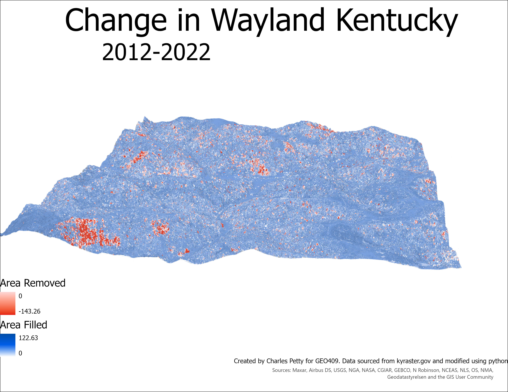

# Change in Wayland, KY

## Change in the area from 2012 to 2022

In this area there was a lot of tree growth as displayed by the large amound of blue on the map. The red however is present in isolated swaths across the area. This could be from flooding as wayland is a lower lying areas and the areas in red are lower in elevation.

  
Wayland, KY

[Link to Wayland PDF](Wayland.pdf)

These maps were created by Charles Petty for GEO409 using kyraster.gov data and then modified using python in ArcGISPro

  
_[Name of the link for video](https://www.youtube.com/watch?v=nFV8ftGN0aM)_